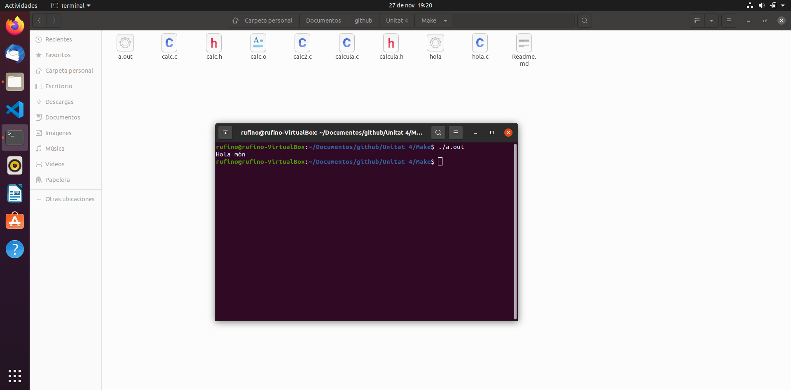
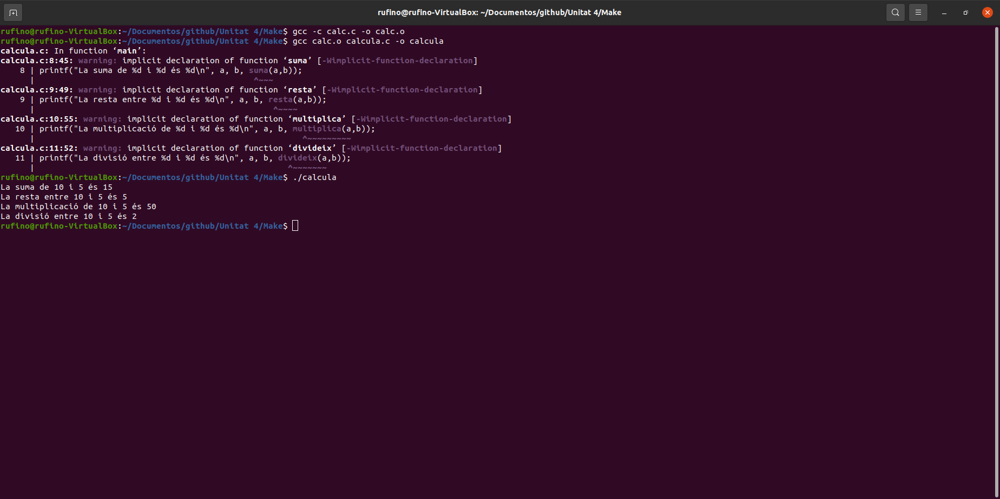
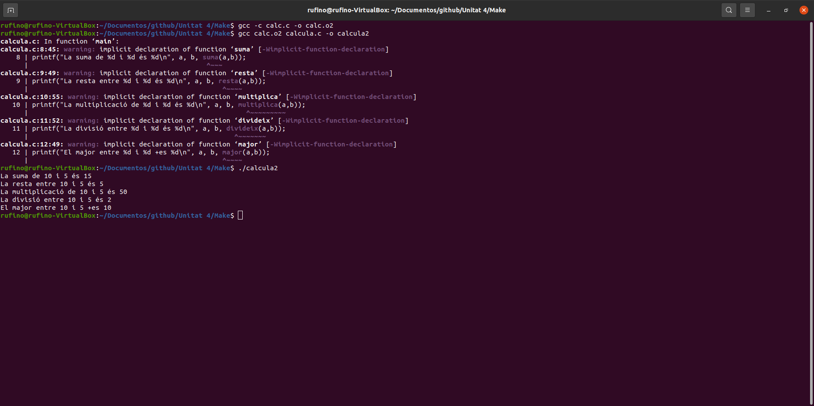
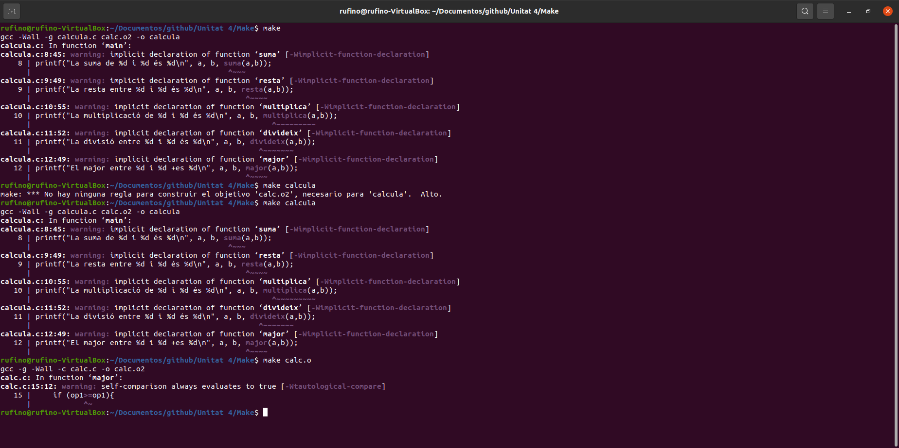
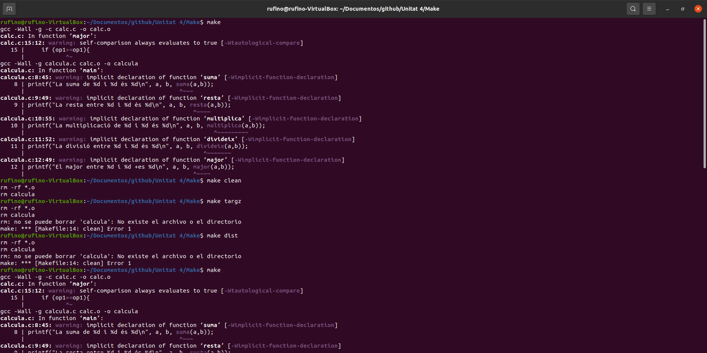
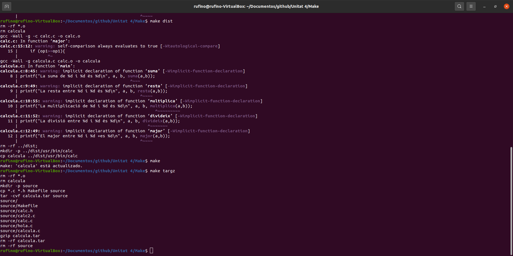
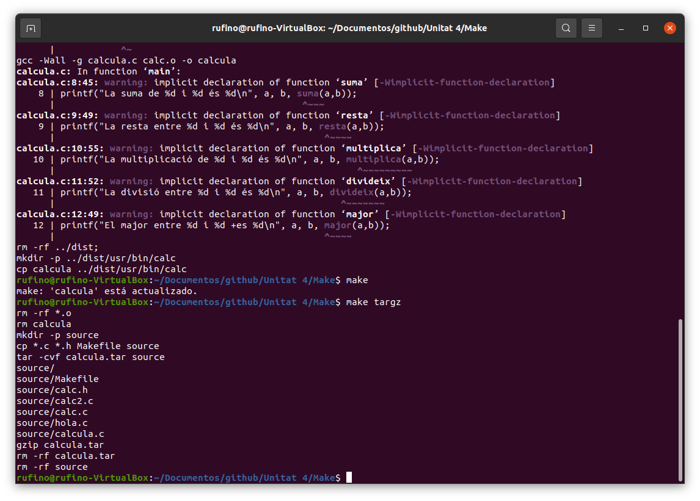

    En aquesta carpeta de github fiquem els archius generats en la pràctica i les captures de pantalla de tot el que he fet.
La primera part era fer un programa per imprimir Caputara de pantalla de la pràctica en C i compilar-ho  
  
   Després creem i compilem la calculadora sense major que i comprovem que funciona  
  
    
   Afegim la funció major compilem i comprovem que funciona 
    
   Continuem amb la resta de passos que ens marca el TODO de la pràctica 
     
     
     
   